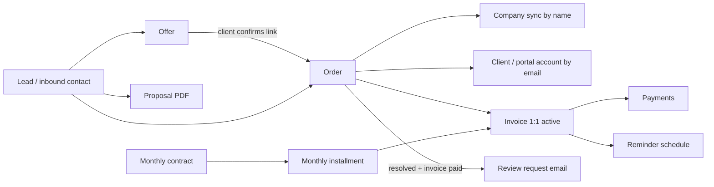
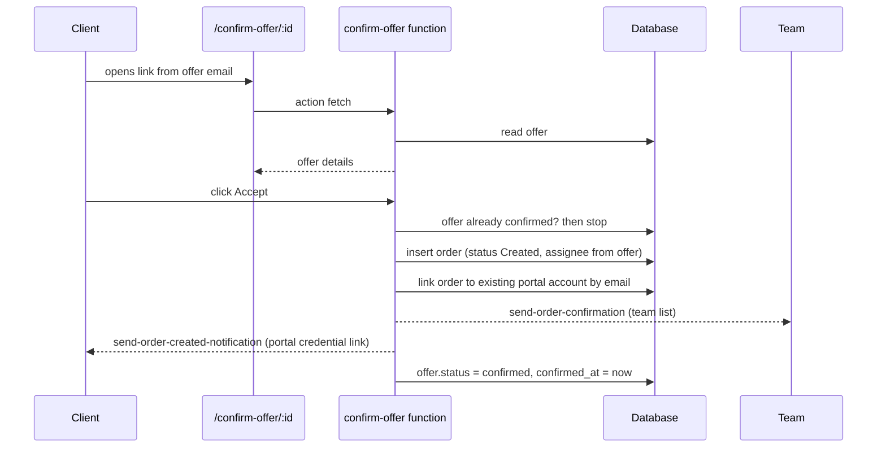

# AB Media Team CRM — Full Functional & Architecture Specification

Version: 2026-09-14. Source of truth: live source code, database triggers, RLS policies and `cron.job` of the production Supabase project.
Scope: documentation only. No behaviour described here was changed while writing it.

> Note: `HANDOFF.md` is older and still mentions `empriadental.de` and a second Resend domain. That is stale. Current verified conventions:
> - Email sending: secret `RESEND_API_KEY_ABMEDIA`, verified sender domain `abm-team.com`.
> - Application links: `https://www.empriatech.com` (`src/config/appUrl.ts`).

---

## 1. Module inventory

| # | Module | Core tables | Main UI | Backend logic |
|---|---|---|---|---|
| 1 | Clients & Companies | `clients`, `companies`, `app_users` | `Clients.tsx`, dialogs | `supabaseCompanySyncService.ts` |
| 2 | Offers (client-confirmable quotes) | `offers` | `Offers.tsx`, public `ConfirmOffer.tsx` | `send-offer-email`, `confirm-offer` |
| 3 | Proposals (internal PDF quotes) | `proposals`, `proposal_line_items` | `Proposals.tsx`, `ProposalDetail.tsx` | `proposalService.ts`, PDF generator |
| 4 | Orders | `orders`, `order_audit_logs`, `order_status_history` | `Orders`, `OrderTable`, `CreateOrderModal` | `orderService.ts` |
| 5 | Invoices & Payments | `invoices`, `invoice_line_items`, `payments`, `invoice_sequences` | `Invoices.tsx`, `InvoiceDetail.tsx` | `invoiceService.ts`, RPCs |
| 6 | Reminders | `invoice_payment_reminders`, `payment_reminders`, `payment_reminder_logs`, `follow_up_reminders` | reminder dialogs, `Reminders.tsx` | 5 reminder edge functions |
| 7 | Monthly billing / installments | `monthly_contracts`, `monthly_installments` | monthly components | `generate-monthly-installments`, `monthly-billing-catchup` |
| 8 | Client Portal | `client_orders` view, `support_inquiries`, `support_replies` | `src/pages/client/*` | portal credential functions |
| 9 | Support & Tickets | `support_inquiries`, `customer_tickets` | Support pages | `create-client-ticket`, support notifications |
| 10 | Work Hours | work-hours tables | `WorkHours`, `WorkHoursAdmin` | `send-workhours-daily-reminder`, `wh-auto-lock`, `check-daily-attendance` |
| 11 | Notifications | `notifications` | in-app bell | order/status services |
| 12 | Audit & Admin | `invoice_audit_logs`, `order_audit_logs` | `InvoiceAuditLogPage.tsx` | `invoiceAuditService.ts` |
| 13 | Reviews | `orders.review_request_sent_at` | order flags | DB trigger → `send-review-request` |
| 14 | Integrations | — | — | Google Sheets sync, Resend, Google Review Place ID |
| 15 | Reporting / ABM metrics | report tables | `WeeklyReportPage.tsx`, `PlatformMetricsCard.tsx` | client-side |

Roles: `super_admin`, `admin`, `worker/employee`, `client`. Clients share the same Auth/`profiles`/`user_roles` infrastructure and are separated exclusively by RLS predicates (`is_client()` / `NOT is_client()`).

---

## 2. Entity lifecycle and relationships

Key relationship rules:
- **Offer → Order**: created by `confirm-offer`; offer becomes `confirmed` and stores `confirmed_at` (idempotency guard).
- **Order → Invoice**: at most one non-cancelled invoice per order, enforced by the partial unique index `uniq_invoices_order_id_active`.
- **Order → Company**: linked by company name synchronisation, not by foreign key.
- **Order → Client portal**: linked by case-insensitive email match.
- **Proposal**: fully standalone. It never creates an order and never sends email.

### 2.1 Status models

**Offers:** `draft → sent → confirmed` (plus expired/cancelled by hand). Live data: 178 confirmed, 156 sent.

**Proposals:** `Draft, Sent, Accepted, Rejected, Expired, Revised` — purely manual labels.

**Invoices:** `draft, sent, paid, partially_paid, overdue, cancelled, refunded`. Live data: 735 paid, 299 sent, 12 draft. `overdue` is only ever set manually; no job promotes an invoice to overdue.

**Orders** do **not** use a single enum. They carry independent boolean flags:

| Flag | Meaning | Side effects when enabled |
|---|---|---|
| `status_created` | order registered | confirmation emails, Sheets sync |
| `status_in_progress` | work started | team/client notification |
| `status_complaint` | complaint open | team notification |
| `status_invoice_sent` | invoice issued | creates/syncs invoice to `sent`, seeds reminder schedule |
| `status_invoice_paid` | payment received | invoice → `paid`, clears `next_reminder_at` |
| `status_resolved` | delivery closed | may send "service delivered" email |
| `status_cancelled` | cancelled | clears reminders |
| `status_deleted` | soft deleted | excluded everywhere, restorable via RPC |
| `status_review` / social flags | follow-up marketing states | reporting |

Because flags are independent, contradictory combinations (e.g. cancelled + resolved) are technically possible; there is no global exclusivity constraint. This is a known design risk.

---

## 3. Automations and triggers

### 3.1 Database triggers

| Trigger | Fires on | Effect |
|---|---|---|
| `orders_review_request_trigger` | order update | when `status_resolved` AND `status_invoice_paid` AND no `review_request_sent_at`, calls `send-review-request` over `net.http_post`; failure never blocks the order update |
| `set_order_status_date` | order update | stamps status change dates |
| `set_orders_updated_at`, profile/updated-at triggers | insert/update | timestamp maintenance |
| invoice line-item triggers | line insert/update/delete | recalculate line totals and invoice totals |
| `update_invoice_status_on_payment` | payments change | sums payments, sets `paid`/`partially_paid`, clears `next_reminder_at` |

### 3.2 Scheduled jobs (live `cron.job`, verified)

| Job | Schedule |
|---|---|
| `send-order-payment-reminders` | every minute |
| `send-follow-up-reminders` | every minute |
| `send-invoice-payment-reminders` | every 15 minutes |
| `send-workhours-daily-reminder` | 06/07/08h, every 15 min, weekdays |
| `wh-auto-lock` | every 5 minutes during configured hours |
| `check-daily-attendance` | weekdays 08:00 |
| `generate-monthly-installments` | 08:00 on the 1st of each month |
| `monthly-billing-catchup` | daily 09:00 |

These schedules exist in the live database only; they are **not** committed as migrations, which is why the code scan could not find them. Treat this as an infrastructure gap to codify.

### 3.3 One-click offer acceptance (end-to-end)

Notes: the confirm page and the `fetch` action are unauthenticated — security relies on the secrecy of the offer UUID. An admin can also confirm on the client's behalf from `Offers.tsx`.

### 3.4 Reminder automation

- Default interval: **168 hours (7 days)**, `src/utils/reminderInterval.ts`.
- Per-invoice override: `invoices.reminder_interval_hours` (1 hour – 30 days).
- Suppression: per-invoice `reminders_paused`, per-client `clients.auto_reminders_enabled = false` (also clears `next_reminder_at`).
- Selection: invoices with status `sent`/`overdue` and `next_reminder_at <= now()`.
- Self-healing: if the linked order is already paid → invoice forced to `paid`; if order is cancelled/deleted → schedule cleared.
- Escalation: wording/urgency escalates at reminder 2 and 3+; frequency stays constant.
- Language auto-detected from client/order address.
- Manual reminders (`send-payment-reminder`, `send-client-payment-reminder`) are unaffected by client suppression.

---

## 4. Invoice numbering and concurrency

- RPC `generate_invoice_number(prefix, year, sequence)` uses `invoice_sequences`, scans existing numbers, and loops until a free number is found. Format `PREFIX-YEAR-NNN`.
- `InvoiceService.createInvoice` retries up to 5 times on `23505` unique-violation of `invoice_number`, and on `order_id` conflict returns the existing active invoice instead of duplicating.
- Every branch (success, retry, conflict, permission error) writes to `invoice_audit_logs` through `InvoiceAuditService`, which never throws.
- `update_invoice_with_lines` performs atomic header + line updates.

**Duplicate-data behaviour:** identical client details no longer hijack an existing client record — matching is strict (exact client, then email, then name overlap). Two orders for the same client produce two independent orders and two invoices. A second invoice for the *same order* is impossible while the first is not cancelled.

---

## 5. Payments

Real gateway integration does not exist yet. `paymentService.ts` is largely mocked (in-memory payment links, stubbed Stripe/PayPal). Real DB-backed rows live in `payments`, and the `update_invoice_status_on_payment` trigger derives status from them. The everyday path is manual: **Confirm Payment Received** → invoice `paid` → order flags synced → `send-payment-confirmation` email.

---

## 6. Client portal

Provisioning paths:
1. Admin: `CreateClientPortalModal` → `create-user` (role `client`, generated password) → order/company link → `send-client-portal-credentials`.
2. Self-service: `request-client-credentials` from `/client/login`, rate-limited to one request per 5 minutes, creates or resets the account, links orders by email, then emails credentials.

Visibility is enforced twice: table RLS plus the `security_invoker` `client_orders` view exposing only client-safe columns. Clients see only their own orders, invoices, company and support threads; they are blocked from team members, payment reminders, email templates, inventory and internal notes.

---

## 7. Email catalogue (summary)

24 outbound edge functions, all using `RESEND_API_KEY_ABMEDIA` and verified `abm-team.com` senders, with in-email links pointing to `empriatech.com`.

Client-facing: offer email, order created, order confirmation, portal credentials, portal invite, status change, service delivered, invoice PDF, payment reminders (manual + automated), payment confirmation, review request, monthly contract/installment mails, ticket confirmations, password change notice.
Internal: order confirmations to the 13-address team list, support/tech-support notifications, follow-up reminders, order payment reminders, work-hours reminders, monthly billing copies.

---

## 8. Dependency matrix (what each action touches)

| Action | Writes | Emails | Other effects |
|---|---|---|---|
| Create offer + send | `offers` | client + team copy | confirm URL generated |
| Client confirms offer | `offers`, `orders` | team confirmation, client order-created | portal auto-link |
| Create order | `orders`, `companies`, notifications | client + team | Google Sheets sync, gamification |
| Toggle order status | `orders`, history, audit, `invoices` | status/service/client mails | invoice create/sync, reminder clearing, review trigger |
| Create invoice | `invoices`, `invoice_line_items`, `invoice_sequences`, `invoice_audit_logs` | — | numbering retry, order-id uniqueness |
| Send invoice | `invoices.status`, `next_reminder_at` | client + team copy | reminder schedule seeded |
| Record payment / mark paid | `payments`, `invoices`, `orders`, `monthly_installments` | payment confirmation | reminders cleared |
| Automated reminder run | `invoices` counters, `invoice_payment_reminders` | client + CC | suppression + self-healing checks |
| Order resolved + paid | `orders.review_request_sent_at` | review request | Google review link |
| Soft delete order | `orders`, audit | — | reminders cleared, restorable |

---

## 9. Known gaps and risks

1. Cron schedules live only in the database, not in migrations — no reproducibility for a new tenant/environment.
2. Order status flags have no exclusivity constraints.
3. Automated invoice reminders log to `invoice_payment_reminders` only, not the unified audit views.
4. `send-client-portal-credentials` emails the plaintext password to the client **and** to ~13 internal mailboxes.
5. Public offer fetch/confirm endpoints are unauthenticated (UUID-secrecy only).
6. Internal notification address lists are duplicated in many edge functions instead of one shared constant.
7. Several functions still show "Thomas Klein" as sender display name.
8. Payments are mocked; no live gateway.
9. `overdue` is never assigned automatically.
10. `HANDOFF.md` contains stale email-domain information.
