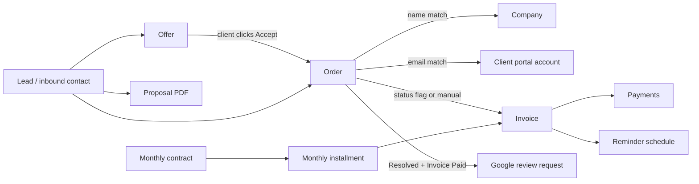
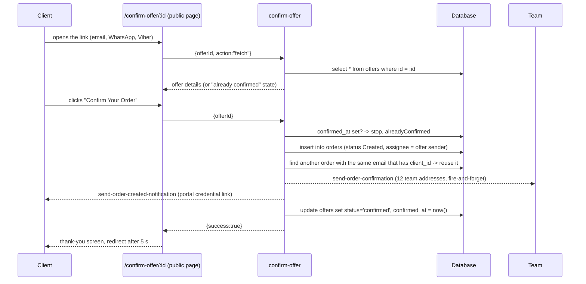

# AB Media Team CRM — Deep Functional & Architecture Specification

Version: 2026-09-14 (v2, deep edition).
Source of truth: the live source code, the live Supabase database (triggers, functions, RLS policies, `cron.job`) and the deployed edge functions of project `fjybmlugiqmiggsdrkiq`.
Scope: **documentation only**. Nothing described here was changed while writing it.

Conventions that apply everywhere:
- **Email sending**: Resend, secret `RESEND_API_KEY_ABMEDIA`, verified sender domain `abm-team.com`. Display senders in use: `AB Media Team <noreply@abm-team.com>` (most transactional mail) and `Thomas Klein <ThomasKlein@abm-team.com>` (client invite, client status update, client payment reminder, customer-ticket alert).
- **Application links inside emails**: `https://www.empriatech.com` (`src/config/appUrl.ts`). `empriadental.de` is retired.
- `HANDOFF.md` is older and still mentions two Resend domains — treat it as stale on that point.

---

# PART 0 — System at a glance

| Layer | Technology |
|---|---|
| Frontend | React 18 + Vite + TypeScript + Tailwind + shadcn/ui |
| Backend | Supabase: Postgres, Auth, Storage, Realtime, Row Level Security |
| Server logic | 45 Deno Edge Functions |
| Scheduling | `pg_cron` + `pg_net` inside the database (8 active jobs) |
| Email | Resend |
| External | Google Sheets sync, Google Business review link |

**Roles**: `admin`, `agent`, `user` (worker), `client`. Clients live in the same Auth system and are separated only by RLS predicates (`is_client()` / `NOT is_client()`) plus the `client_orders` view.

**Four parallel "billing-ish" pipelines exist** and are important to keep apart:
1. One-off invoices created from orders (`invoices`).
2. Monthly contract installments (`monthly_contracts` → `monthly_installments` → `invoices`).
3. Automated invoice payment reminders (`invoice_payment_reminders`).
4. Manually scheduled internal order reminders (`payment_reminders`) and unrelated CRM follow-ups (`follow_up_reminders`).

---

# PART 1 — Module inventory

| # | Module | Core tables | Main UI | Server logic |
|---|---|---|---|---|
| 1 | Clients & Companies | `clients`, `companies`, `app_users`, `profiles` | `Clients.tsx`, `Companies.tsx` | `supabaseCompanySyncService.ts`, `clientAccessService.ts` |
| 2 | Offers (client-confirmable quotes) | `offers` | `Offers.tsx`, public `ConfirmOffer.tsx` | `send-offer-email`, `confirm-offer` |
| 3 | Proposals (internal PDF quotes) | `proposals`, `proposal_line_items`, `proposal_templates` | `Proposals.tsx`, `ProposalDetail.tsx` | `proposalService.ts`, client-side PDF |
| 4 | Orders | `orders`, `order_status_history`, `order_audit_logs` | `Orders`, `OrderTable`, `CreateOrderModal` | `orderService.ts` |
| 5 | Invoices & Payments | `invoices`, `invoice_line_items`, `payments`, `invoice_sequences`, `invoice_audit_logs` | `Invoices.tsx`, `InvoiceDetail.tsx` | `invoiceService.ts`, DB RPCs |
| 6 | Reminders | `invoice_payment_reminders`, `payment_reminders`, `payment_reminder_logs`, `follow_up_reminders` | reminder dialogs, `Reminders.tsx` | 5 edge functions |
| 7 | Monthly billing | `monthly_contracts`, `monthly_installments`, `monthly_cron_runs`, `monthly_cron_contract_results` | monthly pages | `generate-monthly-installments`, `monthly-billing-catchup` |
| 8 | Client portal | `client_orders` view, `support_inquiries`, `support_replies` | `src/pages/client/*` | `request-client-credentials`, `send-client-portal-credentials` |
| 9 | Support & tickets | `support_inquiries`, `support_replies`, `customer_tickets`, `tech_support_tickets`, `ticket_attachments` | Support/Tickets pages | `create-client-ticket`, `create-tech-support-ticket` |
| 10 | Work hours | `work_hours`, `work_hours_v2`, `work_hours_audit_log` | `WorkHours*.tsx` | `wh-*` RPCs, 3 cron functions |
| 11 | Notifications | `notifications`, `notification_settings`, `notification_logs` | bell icon (staff + client) | `notificationService.ts`, many functions |
| 12 | Audit & admin | `invoice_audit_logs`, `order_audit_logs`, `user_audit_logs`, `client_email_logs` | `InvoiceAuditLogPage.tsx` | `invoiceAuditService.ts` |
| 13 | Reviews | `orders.review_request_sent_at` | order flags | DB trigger → `send-review-request` |
| 14 | Inventory | `inventory_items` | `Inventory.tsx` | `useInventory.ts` |
| 15 | Social media & reporting | social tables | `WeeklyReportPage.tsx`, checklists | client-side |
| 16 | Gamification | `user_achievements`, `user_streaks`, `team_challenges`, `reactions` | Rankings, Team | `achievementsService.ts` etc. |

---

# PART 2 — Entity lifecycle and how things link together

## 2.1 The link map — which links are hard and which are soft

| Link | Mechanism | Strength | Failure mode when it misses |
|---|---|---|---|
| Offer → Order | `confirm-offer` copies fields into a new `orders` row | one-way copy, no FK | Offer deleted later → order keeps no trace of VAT breakdown |
| Order → Company | company **name** synchronisation (`supabaseCompanySyncService`) | soft (string) | Renamed company creates a second company record |
| Order → Client portal | case-insensitive `contact_email` match | soft (string) | Client sees nothing in the portal; fixed by re-linking or re-requesting credentials |
| Order → Invoice | `invoices.order_id`, plus legacy `Order ID: <uuid>` text inside `invoices.notes` | hard FK + legacy text fallback | Legacy invoices are only found by the notes regex |
| Invoice → Client | `invoices.client_id` FK | hard | — |
| Invoice → Payment | `payments.invoice_id` FK | hard | — |
| Contract → Installment → Invoice | FKs + `month_label` uniqueness | hard | Duplicate installment prevented by month label check |
| Order → Review | `orders.review_request_sent_at` timestamp | hard idempotency flag | Never sends twice |

**Important structural rule**: at most **one non-cancelled invoice per order**, enforced by the partial unique index `uniq_invoices_order_id_active`. A second attempt does not error out for the user — the code catches Postgres `23505` and returns the existing invoice.

## 2.2 Status models

**Offers** — `draft → sent → confirmed`; `confirmed_at` is the idempotency guard. Expiry/cancellation is manual.

**Proposals** — `Draft, Sent, Accepted, Rejected, Expired, Revised`. Purely manual labels, any transition to any other is allowed.

**Invoices** — `draft, sent, paid, partially_paid, overdue, cancelled, refunded`.
- `paid` / `partially_paid` are set automatically by the DB trigger `update_invoice_status_on_payment` from the sum of `payments` rows, and can also be set manually.
- `overdue` is **never** set automatically by any job — it only appears if a human selects it.
- `sent` and `overdue` are the only reminder-eligible states.

**Orders** — no single enum. 14 independent boolean flags:

| Flag | Meaning | What happens when switched ON |
|---|---|---|
| `status_created` | Registered | Team + optional client confirmation mail, Sheets sync |
| `status_in_progress` | Work started | Team notification, optional client mail |
| `status_complaint` | Complaint open | Team notification |
| `status_invoice_sent` | Invoice issued | Invoice synced or auto-created, status → `sent`, reminder schedule armed |
| `status_invoice_paid` | Payment received | Invoice → `paid`, `next_reminder_at` cleared |
| `status_resolved` | Delivery closed | Optional "service delivered" mail; with Invoice Paid triggers the review request |
| `status_cancelled` | Cancelled | All linked invoice reminders cleared |
| `status_deleted` | Soft deleted | Hidden everywhere, restorable via RPC |
| `status_review` | Review stage | Reporting only |
| `status_facebook`, `status_instagram`, `status_trustpilot`, `status_trustpilot_deletion`, `status_google_deletion` | Marketing/reputation stages | Reporting only |

Because the flags are independent, contradictory combinations (cancelled + resolved) are technically possible. There is no global exclusivity constraint. This is a known design risk, listed again in Part 11.

---

# PART 3 — Action catalogue

For each action: who can do it, where it lives, what is written, what is emailed, what else changes, and what happens on failure.

## 3.1 Offers

### Create and send an offer
- **Who / where**: internal staff, "Send Offer" inside `CreateOrderModal.tsx`.
- **Price maths**: the entered price is the **net** price. If VAT is on, `gross = round(net × (1 + rate/100), 2)`.
- **Writes**: one `offers` row — `client_name/email/phone/address`, `company_name`, `description`, `price = gross`, `currency`, `sent_by`, `sent_by_name`, and `order_data` JSON holding `{companyLink, priority, internalNotes, vatEnabled, vatPercentage, netPrice}`. The VAT breakdown lives **only** in `order_data`.
- **Emails**: `send-offer-email` sends the offer in one of 11 languages to the client (blocking — it must succeed), then fire-and-forget copies to the 12-address team list, paced 600 ms apart. The VAT block (net line + `VAT (x%)` line + "Price incl. VAT") is only rendered when both `vatRate > 0` and `netPrice` are passed.
- **Link**: `https://www.empriatech.com/confirm-offer/{offerId}` is hardcoded in the email.
- **Side effects**: company autofill data synced (fire-and-forget).
- **Failure**: if the offer row fails, nothing is sent. If the client mail fails, the row still exists and can be resent.
- **No idempotency**: each click creates another offer row.

### Share an offer manually (WhatsApp / Viber / copy)
- **Where**: the offer details dialog in `Offers.tsx`.
- Builds the message "Hi {name}, here is your offer from AB Media Team: {link}" where the link always comes from `getOfferConfirmUrl()` — the production domain, never the current preview origin.
- WhatsApp: `https://wa.me/{digits}?text=…`, falling back to a recipient-less `wa.me/?text=…` when no phone number exists. Viber: `viber://forward?text=…` (no recipient targeting possible). Copy: clipboard.
- **Writes**: none. Nothing is sent by the system; a human forwards the link.

### Edit an offer
- Direct update of name, company, email, phone, address, price, description. No audit row is written.

### Resend an offer
- Clones the offer into a **new row** with status `sent`, sends the email for the new ID, then deletes the old row.
- **Known gap**: the resend call does not pass `vatRate`/`netPrice`, so a resent offer email shows no VAT breakdown even if the original had one.
- **Known gap**: if the email throws, the old row is not deleted — you end up with two offers.

### Delete an offer
- Hard delete. No audit trail, no client notification.

### Confirm an offer on the client's behalf
- Admin dialog in `Offers.tsx` with a "send notification to client" toggle; calls `confirm-offer` with `sendToClient` set accordingly. Everything else is identical to the client's own click (Part 4).

## 3.2 Proposals

Proposals are an internal PDF instrument. **They never email a client and never create an order.**

- **Create/edit**: `proposals` + `proposal_line_items`. On update all line items are deleted and reinserted — two people editing the same proposal in parallel will overwrite each other's lines.
- **Numbering**: `AN-{9984 + count + 1}` and `REF-{year}-{count+1}` derived from a count of the user's proposals. Not atomic — two simultaneous creations can collide.
- **VAT**: proposals treat the line-item total as **gross** and derive net backwards (`net = total / (1 + rate/100)`). This is the opposite direction from offers. Default rate 19 %, default bank details are pre-filled constants.
- **Status**: any value can be set to any other from a dropdown; no workflow guard.
- **PDF**: generated fully client-side, per `pdf_language`. Nothing is stored server-side.
- **Delete**: immediate hard delete, line items via FK cascade.

## 3.3 Orders

### Create an order
- **Validation**: company name, contact email and description are mandatory; `company_link` gets `https://` prefixed if missing; price defaults to 0, status to `Created`, priority to `medium`.
- **Writes**: `orders` row; company synced/created by name; activity logged.
- **Emails**: team confirmation to the 13-address list (sequential, 600 ms apart, per-recipient results returned rather than failing the request); optional client confirmation.
- **Side effects**: Google Sheets sync, gamification counters, notification rows.

### Toggle an order status (the single busiest action in the system)
`OrderService.toggleOrderStatus(orderId, status, enabled, customMessage?, sendToClient?)`. Ordered sequence:

1. Requires an authenticated user; loads the current order row.
2. Maps the label to its boolean column and updates it plus `updated_at`.
3. Inserts `order_status_history` (status, actor id + name, "added"/"removed").
4. Writes an `order_audit_logs` activity row.
5. If the order is assigned to somebody else, inserts an in-app `notifications` row for the assignee with `action_url = /dashboard?order={id}`.
6. Sends the internal status-change email through `StatusChangeNotificationService` (only when the flag is being **enabled**, deduped 60 s per order+status, recipients and per-status on/off read from the `notification_settings` table, every send logged to `notification_logs`).
7. **Cancelled → ON**: clears `next_reminder_at` on every invoice linked to the order.
8. **Invoice Sent / Invoice Paid**: see 3.4 below.
9. **Client email** (only when `sendToClient` is true and the flag is being enabled): `send-client-status-notification`, deduped 30 s in the browser.
10. **Resolved → ON** with client opt-in: `send-service-delivered-notification`.
11. **Resolved or Invoice Paid → ON**: re-reads the order and, if `status_resolved && status_invoice_paid && review_request_sent_at is null && contact_email`, fires `send-review-request` directly (deliberately not through the 8-second email queue, so it is not stuck behind the 12-recipient status blast).

Every email step is wrapped so that a mail failure never blocks the status change.

### Soft delete / restore / permanent delete
- Soft delete and restore run through the `soft_delete_order` / `restore_order` RPCs; soft-deleted orders are excluded from every list by `deleted_at is null` + `status_deleted <> true`, and reminders are cleared.

### Assign / unassign
- Updates `assigned_to`, `assigned_to_name`, logs the activity, creates an assignee notification.

## 3.4 Invoices

### The three ways an invoice is born
| Path | Trigger | Notes |
|---|---|---|
| A — manual | "Create invoice" in the invoice UI | `order_id` left null unless supplied |
| B/C — from an order | toggling **Invoice Sent** or **Invoice Paid** when no invoice exists | `order_id` set at insert time |
| D — monthly | `generate-monthly-installments` cron | created directly as `sent` with the reminder pre-armed |

### Invoice creation in detail (`InvoiceService.createInvoice`)
1. Requires a session, otherwise "Authentication required".
2. Attempt loop: `5` attempts for auto-numbers, `1` when the user typed a custom sequence.
3. Each attempt calls the RPC `generate_invoice_number(prefix 'INV', year, sequence)` which reads `invoice_sequences`, scans existing numbers, and loops until a free number is found. Format `INV-YYYY-NNN`, unpadded above 999.
4. Inserts the `invoices` row, including `order_id` when an audit context supplied one.
5. **Order conflict** (`23505` mentioning `order_id`/`uniq_invoices_order_id_active`): does **not** fail. Re-reads the existing non-cancelled invoice for that order and returns it, logging outcome `success` with `phase: existing_returned_on_order_conflict`.
6. **Number conflict** (`23505` mentioning `invoice_number`): logs `phase: retry_conflict` and retries. After the last attempt it raises "This invoice number already exists. Please refresh and try again." and logs `phase: final_conflict`.
7. Line items are inserted one by one into `invoice_line_items`. If any fails, the just-created invoice row is deleted (manual compensation — not a real transaction).
8. Every outcome writes `invoice_audit_logs` through `InvoiceAuditService`, which classifies errors into `conflict_409`, `permission_denied`, `validation_error`, `unknown_error`, auto-fills the actor, and **never throws** (a failed audit write is only a console warning).
9. `invoice_sequences` is advanced with `max(current, sequence)` so a manual low number can never rewind the counter.

### Auto-creation from an order status toggle
When no invoice exists for the order, the toggle path also resolves the client with a strict three-step match designed to stop client hijacking:
1. exact name **and** email match;
2. email match **only if** the client name overlaps the order's company name;
3. name-only exact match;
4. otherwise create a new client (synthesising `name@company.com` if the order has no email).

Line items come from the order's inventory JSON when present, otherwise a single line with the order description and price. Due date = today + 30 days, terms `Net 30`, notes record the order ID. The new invoice is then pushed to `sent` or `paid` through the `sync_invoice_status` RPC (which bypasses RLS).

### Edit an invoice
- Header + lines are saved atomically through the RPC `update_invoice_with_lines`; totals and VAT are recalculated by DB triggers, not in the browser.
- **Bill-To overrides**: `bill_to_name/email/address/city/zip_code/country` on the invoice win over the linked client record. They are hydrated from the invoice first and only fall back to the client for empty fields. Changing the client dropdown afterwards refills all six.
- Unsaved header changes are auto-saved on unmount (line items are not), and a `beforeunload` warning fires on tab close.

### Send an invoice
- `send-invoice-pdf` mails the client-side generated PDF to the client, then the same PDF to the 13-address team list (batched 2 at a time, 1 s apart). No DB write of its own — status and reminder scheduling are handled by the calling UI.

### Record a payment / mark paid
- `payments` rows are inserted by `InvoiceService.addPayment` (no balance validation).
- The DB trigger `update_invoice_status_on_payment` sums payments and sets `paid` or `partially_paid`, clearing `next_reminder_at`.
- Setting the invoice to `paid` in the UI also flips the order's **Invoice Paid** flag and updates any linked `monthly_installments` row (`payment_status`, `paid_at`).
- `send-payment-confirmation` emails a green "Payment received" confirmation to the client and a copy to the team. It writes nothing to the database.

### Real card/bank payment
- Not implemented. `paymentService.ts` is a demo: payment links are held in an in-memory object, Stripe/PayPal handlers only log. The real-world path is manual confirmation.

## 3.5 Reminders — four separate systems

### System 1 — automated invoice reminders (`send-invoice-payment-reminders`, every 15 minutes)
- **Selection**: `invoices` where `status in ('sent','overdue')` and `next_reminder_at is not null` and `next_reminder_at <= now()`.
- **Guards, in order**:
  1. `invoices.reminders_paused` → skip.
  2. Fresh re-read of status and pause flag (protects against a payment landing mid-run).
  3. Order resolved from `invoices.order_id`, else from a `Order ID: <uuid>` regex on `invoices.notes`.
  4. Order cancelled or deleted → skip **and** clear `next_reminder_at`.
  5. **Self-healing**: order already `status_invoice_paid` but invoice not → force the invoice to `paid`, clear the schedule, skip.
  6. Client `auto_reminders_enabled = false` (matched via the embedded client or a case-insensitive email match) → skip and clear the schedule.
- **Language**: detected from the client/order address across `de, nl, fr, es, da, no, cs, pl, sv`, default `en`.
- **Escalation**: reminder 1 = neutral blue; reminder 2 = amber "Follow-Up"; reminder 3+ = red "Urgent". Frequency never changes — only tone.
- **Recipients**: the client, plus deduped `invoices.cc_emails` (max 10, validated in the UI). **No team copy** — the team watches reminders inside the app.
- **Writes per send**: `invoices.reminder_count += 1`, `last_reminder_sent_at = now()`, `next_reminder_at = now() + interval`; one row in `invoice_payment_reminders` (`reminder_number`, `sent_to_client`, `sent_to_team=false`).
- **Interval**: `invoices.reminder_interval_hours`, default **168 hours (7 days)** from `src/utils/reminderInterval.ts`; adjustable per invoice between 1 hour and 30 days.
- **Errors**: caught per invoice; the loop continues and the run reports `{processed, errors}`.
- **Test mode**: posting `{test_mode:true, test_email, test_language}` sends a specimen without touching data.

### System 2 — manually scheduled internal order reminders (`payment_reminders`, every minute)
- A staff member schedules a reminder on an order. Creating one **cancels any other scheduled reminder for the same order**.
- The cron mails the 12-address internal team (500 ms apart) with the order details and a `dashboard?orderId=` button, sets the reminder to `sent`, writes a `payment_reminder_logs` row and creates in-app notifications for every non-disabled profile. The **client is never emailed** by this system.

### System 3 — ad hoc client reminder (button, not cron)
- `send-client-payment-reminder`: JWT-protected, uses either a chosen template or the built-in one, can attach the invoice PDF, sends from `Thomas Klein <ThomasKlein@abm-team.com>`, then notifies the team individually. Writes both a `client_email_logs` row and a `payment_reminder_logs` row.
- `send-payment-reminder`: simpler free-text variant (subject ≤200 chars, body ≤10 000 chars) sent to a single recipient with no team copy and **no audit row**.
- Neither of these honours the per-client `auto_reminders_enabled` switch — that switch only stops the automatic system.

### System 4 — CRM follow-ups (`follow_up_reminders`, every minute)
- Sales call-back reminders with optional attachments, mailed to the internal list, `status` set to `sent` — and explicitly to `failed` when the send throws (the only reminder system that records failure state).

All reminder emails carry the same hardcoded three-bank payment block (Belgium/Wise, Germany/Postbank, UK/Wise) regardless of the client's country.

## 3.6 Monthly contracts and installments

- **Generator** (`generate-monthly-installments`, 08:00 on the 1st, also callable per contract): opens a `monthly_cron_runs` row, then per contract writes a `monthly_cron_contract_results` row with `already_sent | sent | skipped | failed`.
- **Idempotency**: `(contract_id, month_label)` — it also checks the German month label as a fallback in case the detected language changed.
- **Repair**: an installment that exists but has not been emailed reuses its invoice, or creates one and resends.
- **Client resolution**: exact name+email, then email-only, then create.
- **Invoice**: numbered via the same RPC but with **no retry loop**, inserted directly as `sent` with `next_reminder_at = now + 168 h`, one line item, VAT from the contract.
- **PDF**: generated server-side with jsPDF — a second, independent renderer from the browser one.
- **Email**: client mail with one automatic retry on HTTP 429 after 1.5 s; 2 s between client and team mail, 4 s between contracts; the team copy is a single Resend call using `to: invoice@team-abmedia.com` + BCC for the rest.
- **Contract lifecycle**: when the computed month exceeds `duration_months`, the contract is set to `completed` automatically.
- **Catch-up** (`monthly-billing-catchup`, daily 09:00): finds due unpaid installments that were never emailed or have no invoice, resets orphans (`email_sent = true` but no invoice) back to pending, finds active contracts with no installment for the current month, and re-triggers the generator per contract with a 3 s stagger.

## 3.7 Client portal

### Three provisioning paths
| Path | Function | Auth | Notes |
|---|---|---|---|
| A — invite only | `send-client-invite` | staff JWT | Sends a login invitation with no password; logs `Login Invite Sent` to `order_audit_logs` |
| B — admin issues credentials | `send-client-portal-credentials` | staff JWT **or** service role | Emails the plaintext password to the client and a copy to the 13 internal addresses; logs `client_portal_credentials_sent/_resent` |
| C — self-service | `request-client-credentials` | public | Reached from `…/client/login?requestCredentials={orderId}` in the order-created email |

Path C in detail: rate-limited to one request per 5 minutes per order (checked against `order_audit_logs`); generates a 14-character random password; updates an existing client Auth user or creates one (`email_confirm: true`), searching up to 20 000 Auth users when the email exists but is not yet tagged as a client; sets `profiles.role = 'client'`, upserts `user_roles` and `app_users`; links the triggering order and **retro-links every other order with the same contact email that has no client yet**; then delegates to path B; logs `client_self_service_credentials`.

### What a client can see
- All portal reads go through the `client_orders` **view**, which exposes only client-safe columns (no internal notes, no assignee).
- Filter: `client_id = auth.uid() OR client_user_id = auth.uid()` (two columns for historical reasons; companies are linked by `client_user_id`).
- Enforced twice: RLS on the tables and the restricted view. Clients cannot read other companies, team members, payment reminders, email templates or inventory.
- Realtime: orders are subscribed on the raw table filtered by `client_id`.

## 3.8 Support and tickets — three systems

1. **Support inquiries** (portal, threaded): client creates an inquiry → `support_inquiries` row → in-app notifications for every **admin** → `send-support-inquiry-notification` to the 13-address list (sent after the HTTP response returns, 600 ms apart). Replies insert `support_replies`; a client reply notifies admins again, but a staff reply creates **no** notification for the client — the client only sees it live or on revisit. Read state is tracked per inquiry for the "NEW" badge. A complaint deep link from the service-delivered email pre-fills the subject and opens the dialog.
2. **Customer tickets** (from the "Need Help?" button in status emails): `create-client-ticket` accepts POST or a legacy GET redirect, dedupes any ticket for the same order+email created within 5 minutes, inserts `customer_tickets`, then in the background mails the 13 addresses and inserts in-app notifications for **admins and agents**.
3. **Tech support tickets** (internal): `create-tech-support-ticket` requires a JWT, writes `tech_support_tickets`, uploads attachments to the `ticket-attachments` bucket with 7-day signed URLs, and on any downstream failure performs a full manual rollback (storage files, attachment rows, ticket row). The notification email renders images inline.

## 3.9 Work hours

- **Legacy** `work_hours`: simple upsert on `(user_id, date)`, last write wins, no audit, no locking.
- **V2** `work_hours_v2`: timezone pinned to Europe/Sarajevo, submission deadline 12:00, all writes through `SECURITY DEFINER` RPCs — `wh_submit`, `wh_admin_upsert` (reason mandatory), `wh_admin_unlock` (reason mandatory), `wh_admin_bulk_set_lock`, `wh_auto_lock_today`. Every change lands in `work_hours_audit_log`; a five-address super-admin allowlist gates the override UI.
- **Crons**: `send-workhours-daily-reminder` runs every 15 minutes between 06:00 and 08:00 UTC on weekdays but self-gates to actually send only in the 09:30–09:44 Sarajevo window (unless forced); the Bosnian-language reminder goes to 10 recipients (management and `service@` are deliberately excluded). `wh-auto-lock` simply calls `wh_auto_lock_today()` every 5 minutes in the configured hours. `check-daily-attendance` runs weekdays at 08:00 and now only counts — it deliberately no longer writes absence rows, because absence is inferred from the missing submission.

## 3.10 Clients and companies

- Clients can be created and edited directly, including the **Reminders off** switch (`clients.auto_reminders_enabled`). Turning it off also clears `next_reminder_at` on that client's invoices.
- Companies are created and kept in sync from order company names. Linking or unlinking a client to an order writes `order_audit_logs` entries ("Client Access Granted" / "Revoked").

---

# PART 4 — One-click offer acceptance, end to end

Step-by-step detail:

1. **Link generation.** Either the offer email's CTA or the manual WhatsApp/Viber/copy actions. All of them use `https://www.empriatech.com/confirm-offer/{offerId}`.
2. **Page load.** `ConfirmOffer.tsx` calls `confirm-offer` with `action: "fetch"`. The endpoint is unauthenticated — security rests entirely on the secrecy of the offer UUID, and the fetch returns the whole offer row (including `order_data` and `sent_by`), even though the page renders only a subset.
3. **Already confirmed.** If `confirmed_at` is set, the page shows a confirmed state and the button is not offered.
4. **Accept.** The client's own click sends no `sendToClient` flag, so the server default `true` applies — a client-initiated acceptance **always** sends the client the order-created email. The admin-side dialog can turn that off.
5. **Idempotency.** `confirmed_at` is checked before anything is written. It is a read-then-write check, not atomic, so two truly simultaneous submits could in theory both pass.
6. **Order insert.** Offer fields map to order fields; `order_data.companyLink/internalNotes/priority` are unpacked; `created_by` and `assigned_to` both become the offer's sender; `status_created` is set true. **The VAT breakdown is not copied** — the order keeps only the gross price.
7. **Portal auto-link.** Looks for another order with the same email that already has a `client_id` and reuses it. Errors are only logged.
8. **Team notification.** Fire-and-forget `send-order-confirmation` to the 12 internal addresses; the email includes internal notes.
9. **Client notification.** Fire-and-forget `send-order-created-notification`, whose CTA is `…/client/login?requestCredentials={orderId}` — this is what lets the client obtain portal credentials themselves.
10. **Offer closed.** `status = 'confirmed'`, `confirmed_at = now()`. A failure here is logged but not surfaced: the order exists, the offer could still read as `sent`.
11. **After.** The order now behaves like any other order: status flags, invoicing, reminders, review request.

---

# PART 5 — Automations and triggers

## 5.1 Database triggers

| Trigger / function | Fires on | Effect |
|---|---|---|
| `trigger_review_request_on_order_update` | `orders` update | If `status_resolved` and `status_invoice_paid` and no `review_request_sent_at`, calls `send-review-request` via `net.http_post`. Failure never blocks the update |
| `update_order_status_date` | `orders` update | Stamps the status-change date |
| `update_orders_updated_at`, `set_updated_at`, `update_updated_at_column` | many tables | Timestamp maintenance |
| `update_line_item_total` | `invoice_line_items` | Recomputes the line total from quantity, price, discount, VAT |
| `trigger_recalculate_invoice_totals` | line item insert/update/delete | Recomputes invoice totals |
| `update_invoice_status_on_payment` | `payments` change | Sums payments, sets `paid`/`partially_paid`, clears `next_reminder_at` |
| `handle_new_user`, `handle_new_user_permissions`, `handle_new_user_settings` | new Auth user | Creates profile, permissions, settings |
| `prevent_role_change` | `profiles`/roles | Blocks privilege escalation |

Security-definer helpers used by policies: `is_admin()`, `is_client()`, `has_role(uuid, app_role)`, `get_user_role()`, `is_client_of_company(uuid)`, `wh_is_super_admin()`.

## 5.2 Scheduled jobs (live `cron.job`, verified)

| Job | Schedule (UTC) | Scans | Writes | Sends | If a run is missed |
|---|---|---|---|---|---|
| `send-payment-reminders-cron` | `* * * * *` | due `payment_reminders` | reminder status, `payment_reminder_logs`, notifications | internal team | picked up next minute |
| `send-follow-up-reminders` | `* * * * *` | due `follow_up_reminders` (max 50) | status `sent`/`failed` | internal team | next minute |
| `send-invoice-payment-reminders` | `*/15 * * * *` | `sent`/`overdue` invoices due | invoice counters, `invoice_payment_reminders` | client + CC | next quarter hour, no catch-up burst (each invoice is still only due once) |
| `send-workhours-daily-reminder` | `*/15 6,7,8 * * 1-5` | staff list | — | 10 workers, Bosnian | window missed = no reminder that day |
| `wh-auto-lock-every-5min` | `*/5 10-13 * * *` | today's work hours | locks rows, audit log | — | locked on the next tick |
| `check-daily-attendance` | `0 8 * * 1-5` | staff activity signals | nothing (counts only) | — | harmless |
| `generate-monthly-installments` | `0 8 1 * *` | active contracts | installments, invoices, run logs | client + team | recovered by the catch-up job |
| `monthly-billing-catchup` | `0 9 * * *` | overdue/orphaned installments | resets orphans | re-triggers the generator | retried the next day |

These schedules exist **only in the live database** — they are not committed as migrations. See Part 11.

---

# PART 6 — Notification map

## 6.1 Client-facing email

| # | Trigger | Function | Condition | Blocking? |
|---|---|---|---|---|
| 1 | Offer sent | `send-offer-email` | staff clicks Send Offer | blocking |
| 2 | Offer accepted | `send-order-created-notification` | client confirms, or admin confirms with the toggle on | fire-and-forget |
| 3 | Order created manually | `send-order-confirmation` (client variant) | opt-in at creation | fire-and-forget |
| 4 | Order status changed | `send-client-status-notification` | `sendToClient` on, flag being enabled, 30 s dedupe | blocking within the call |
| 5 | Order resolved | `send-service-delivered-notification` | `sendToClient` on | blocking within the call |
| 6 | Resolved + invoice paid | `send-review-request` | `review_request_sent_at` null, valid `ChIJ…` place ID | fire-and-forget |
| 7 | Invoice sent | `send-invoice-pdf` | staff action | blocking |
| 8 | Automatic payment reminder | `send-invoice-payment-reminders` | see 3.5 system 1 | cron |
| 9 | Manual payment reminder | `send-client-payment-reminder` / `send-payment-reminder` | staff action | blocking |
| 10 | Payment received | `send-payment-confirmation` | staff marks paid | blocking |
| 11 | Portal invite | `send-client-invite` | staff action | blocking |
| 12 | Portal credentials | `send-client-portal-credentials` | admin or self-service | blocking |
| 13 | Self-service credentials | `request-client-credentials` → 12 | client clicks the portal link | blocking |
| 14 | Password changed | `notify-password-change` | portal settings | blocking |
| 15 | Monthly contract created | `send-monthly-contract-created` | contract created | blocking |
| 16 | Monthly installment | `generate-monthly-installments` | cron | cron |
| 17 | Monthly toggle | `send-monthly-toggle-notification` | staff action | blocking |
| 18 | Ticket confirmation | `create-client-ticket` | client opens a ticket | background |

## 6.2 Internal email

| Trigger | Function | Recipients |
|---|---|---|
| Offer sent | `send-offer-email` (copy) | 12 addresses |
| Order created / updated | `send-order-confirmation` | 13 addresses |
| Any status enabled | `send-status-change-notification` | `notification_settings.recipient_emails`, per-status switches |
| Support inquiry | `send-support-inquiry-notification` | 13 addresses |
| Customer ticket | `create-client-ticket` | 13 addresses |
| Tech support ticket | `send-tech-support-notification` | 13 addresses |
| Order payment reminder due | `send-order-payment-reminders` | 12 addresses |
| CRM follow-up due | `send-follow-up-reminders` | 13 addresses |
| Client reminder sent | `send-client-payment-reminder` (copy) | 12 addresses |
| Invoice PDF sent | `send-invoice-pdf` (copy) | 13 addresses |
| Payment received | `send-payment-confirmation` (copy) | 13 addresses |
| Portal credentials | `send-client-portal-credentials` (copy, includes the password) | 13 addresses |
| Monthly billing | `generate-monthly-installments` | 1 To + BCC rest |
| Work-hours reminder | `send-workhours-daily-reminder` | 10 workers |

## 6.3 In-app notifications (`notifications` table)

| Written by | Recipients | Action URL |
|---|---|---|
| Order status toggle | the assignee, when it is not the actor | `/dashboard?order={id}` |
| `send-order-payment-reminders` | every profile with notifications enabled | order view |
| Support inquiry / reply by a client | all admins | `/support/{id}` |
| Customer ticket | admins **and** agents | `/customer-tickets` |
| Monthly billing | team | monthly view |

Delivery: one shared `notifications` table for staff and clients. The client bell filters on `action_url like '/client/%'`; the staff bell shows everything addressed to the user. Both use a Supabase realtime channel plus a `notifications:changed` window event as a fallback refresh.

## 6.4 Configurable switches

- `notification_settings` — master `enabled` flag, per-status `notify_on_status_*` booleans, `recipient_emails[]`. Only the order status-change email honours it.
- `clients.auto_reminders_enabled` — stops automatic invoice reminders only.
- `invoices.reminders_paused` — stops reminders for one invoice.
- `invoices.cc_emails`, `invoices.reminder_interval_hours` — per-invoice reminder configuration.

---

# PART 7 — Dependency matrix

| Action | Reads | Writes | Emails | Also triggers | If it fails |
|---|---|---|---|---|---|
| Create + send offer | inventory, company autofill | `offers` | client + 12 team | company sync | no offer, no mail |
| Client accepts offer | `offers`, `orders` | `orders`, `offers` | 12 team + client | portal auto-link | order may exist while offer still reads `sent` |
| Create order | companies, clients | `orders`, `companies`, `notifications` | team + optional client | Sheets sync, gamification | order rejected if required fields missing |
| Toggle status | order, invoices, notification settings | order flags, `order_status_history`, `order_audit_logs`, `notifications`, `invoices` | internal + optional client + review | invoice create/sync, reminder clearing | status still changes; email failures are logged only |
| Create invoice | clients, `invoice_sequences` | `invoices`, `invoice_line_items`, `invoice_sequences`, `invoice_audit_logs` | — | number retry, order-uniqueness fallback | user sees a retry message; audit row records the cause |
| Edit invoice | invoice, client | header + lines atomically | — | totals recalculated by trigger | atomic, nothing partially saved |
| Send invoice | invoice, PDF | `invoices.status`, `next_reminder_at` | client + team copy | reminder schedule armed | invoice stays unsent |
| Record payment | invoice | `payments`, `invoices` (trigger), `orders`, `monthly_installments` | payment confirmation | reminders cleared | status stays unpaid |
| Automatic reminder run | invoices, orders, clients | invoice counters, `invoice_payment_reminders` | client + CC | self-healing status fixes | that invoice is retried next run |
| Monthly generation | contracts, installments | installments, invoices, run logs | client + team | contract auto-completion | catch-up job repairs it |
| Client requests credentials | `order_audit_logs`, Auth | Auth user, `profiles`, `user_roles`, `app_users`, `orders.client_id` | credentials to client + team | retro-links old orders | rate-limited message after a recent send |
| Client opens a ticket | order, company | `customer_tickets`, `notifications` | 13 team | — | duplicate within 5 min is ignored |
| Soft delete order | order | `orders`, audit | — | reminders cleared | restorable |

---

# PART 8 — Roles and permissions

| Module | admin | agent | user (worker) | client |
|---|---|---|---|---|
| Orders | full, including delete | create, update, view per permission | assigned/own orders | own orders via `client_orders` view only |
| Offers | full | full | full | none |
| Proposals | full | own | own | none |
| Invoices | full | full (team policies) | full (team policies) | own invoices only |
| Payments | full | via invoice ownership | via invoice ownership | read only |
| Clients / companies | full | manage own | manage own | own company only |
| Reminders | full | full | full | none |
| Email templates, inventory | full | full | full | blocked |
| Team members / rankings | full | visible | visible | excluded from `team_members_view` |
| Support inquiries | all | own/assigned | own | own only |
| Work hours | admin + super-admin overrides | own | own | none |
| User roles | manage | read own | read own | read own |

Key policy names in the live database: `Clients can view their own orders`, `Team can view companies, clients only their own`, `Non-client authenticated users can … offers`, `Team can manage invoices`, `wh_v2_select_self_or_admin`. Roles are stored in `user_roles` (never on the profile) and read through the security-definer `has_role()`.

---

# PART 9 — Edge cases and failure behaviour

| Situation | What actually happens |
|---|---|
| Two clients share one email address | Invoice client matching is strict: exact name+email, then email **only with a name overlap**, then name-only, then create new. Prevents one company's invoices landing on another's record |
| Two orders for the same client | Two independent orders and two independent invoices. Nothing is merged |
| A second invoice for the same order | Impossible while the first is not cancelled. The attempt silently returns the existing invoice |
| Invoice number collision | Up to 5 automatic retries with a fresh number; every attempt is in `invoice_audit_logs`. A manually typed number gets one attempt and a clear error |
| Offer confirmed twice | The second call returns `alreadyConfirmed` without writing. A genuinely simultaneous double submit is theoretically possible |
| Offer deleted after acceptance | The order survives, but the VAT breakdown is lost — it lived only on the offer |
| Resent offer with VAT | The resent mail currently shows no VAT breakdown |
| Resend rate limit (2/sec) | Every multi-recipient function paces itself (500–1500 ms); monthly billing additionally retries once on HTTP 429 |
| Email provider rejects a team address | Bulk senders return per-recipient results and still report success; only the server log shows the failure |
| Client has no portal account | Status and invoice emails still go to `contact_email`; the portal CTA leads to the self-service credential request |
| Client requests credentials twice | Blocked for 5 minutes with a friendly message |
| Order cancelled with an open invoice | Reminders are cleared; the invoice itself keeps its status |
| Order marked paid but invoice not | Fixed automatically on the next reminder run (self-healing) |
| Monthly run crashes halfway | `monthly_cron_runs` records `completed_with_errors` or `failed`; the daily catch-up repairs orphans and re-triggers per contract |
| Line item insert fails during invoice creation | The invoice row just created is deleted again |
| Audit log insert fails | Swallowed by design — auditing never blocks business actions |
| Worker misses the 12:00 deadline | Auto-lock closes the day; only an admin can unlock, and must give a reason, which is recorded |

---

# PART 10 — Integrations

| Integration | Purpose | Configuration |
|---|---|---|
| Resend | all outbound email | `RESEND_API_KEY_ABMEDIA`, verified `abm-team.com` |
| Google Sheets | order mirror | `sync-order-to-sheets`, service account |
| Google Business | review links | `GOOGLE_REVIEW_PLACE_ID`, must start with `ChIJ` |
| Supabase Storage | ticket attachments, files | `ticket-attachments` bucket, 7-day signed URLs |
| Supabase Realtime | orders, offers, support, notifications, work hours | channels cleaned up on unmount |
| `pg_cron` + `pg_net` | 8 scheduled jobs | live database only |

---

# PART 11 — Known gaps and risks

1. **Cron schedules exist only in the database**, not in migrations — a new environment starts with no automation.
2. **Order status flags have no exclusivity rules** — cancelled + resolved can both be true.
3. **Resent offers lose their VAT breakdown**, and VAT is never copied from the offer onto the order.
4. **Offers and proposals compute VAT in opposite directions** (net→gross vs gross→net).
5. **Portal credentials are emailed in plaintext** to the client and to ~13 internal mailboxes.
6. **Public offer endpoints are unauthenticated** and return the full offer row; security is UUID secrecy only.
7. `send-status-change-notification` has no JWT check while its client-facing twin does.
8. `send-service-delivered-notification` picks the most recent invoice in the system rather than the order's own invoice.
9. **Internal address lists are duplicated in about nine places** instead of one shared constant.
10. **Payments are mocked** — no live gateway; `partially_paid` only comes from the payments trigger.
11. `overdue` is never assigned automatically.
12. **Proposal numbering and reference generation are not atomic** and can collide.
13. **Proposal line items are deleted and reinserted on save** — concurrent edits overwrite each other.
14. Staff replies to a support inquiry create no notification for the client.
15. Some senders still display "Thomas Klein" rather than a team identity.
16. `HANDOFF.md` contains stale email-domain information.
